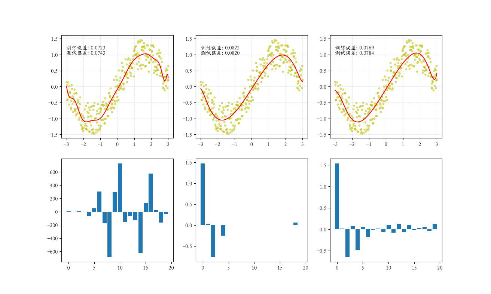
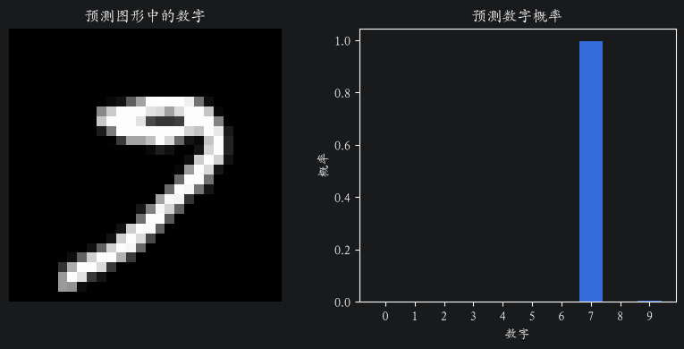

# 数据分析

- [NumPy 笔记](notes/numpy.md)
- [Pandas 笔记](notes/pandas.md)
- [Matplotlib 笔记](notes/matplotlib.md)
- [Seaborn 笔记](notes/seaborn.md)

# 机器学习基础

* 机器学习方法汇总


* 有监督训练核心流程：


## 数学原理

- [线性回归数学原理](./notes/math-linear-regression.md)
- [逻辑回归数学原理](./notes/math-logistic-regression.md)

## 工程案例

- [线性回归、正则化、过拟合与欠拟合](./ml-base/02_regularization.py)
<div style="text-align: center;">
    
</div>

- [LR 梯度下降实现](./ml-base/linear_regression/02_gradient_descent.ipynb)
- [逻辑回归、数字识别](./ml-base/logistic_regression/digit_recognizer.ipynb)
<div style="text-align: center;">
    
</div>

- [KNN 心脏病预测、交叉验证、网格搜索](./ml-base/knn/05_heart_disease_GridSearchCV.ipynb)
- [分类器评估](./ml-base/classification/classification_evaluation.ipynb)
- [感知机原型](./ml-base/perception/01_logic_gate.ipynb)

## 特征工程

- [特征工程](notes/feature-engineering.md)

```
低方差过滤 ｜ 相关系数法 ｜ 独热编码 ｜ 标准化 ｜ PCA | 列转换器
```

## 核心 API

- [sklearn API 总结](./notes/sklearn.md)

## 公式总结

- [公式总结](notes/formula.md)