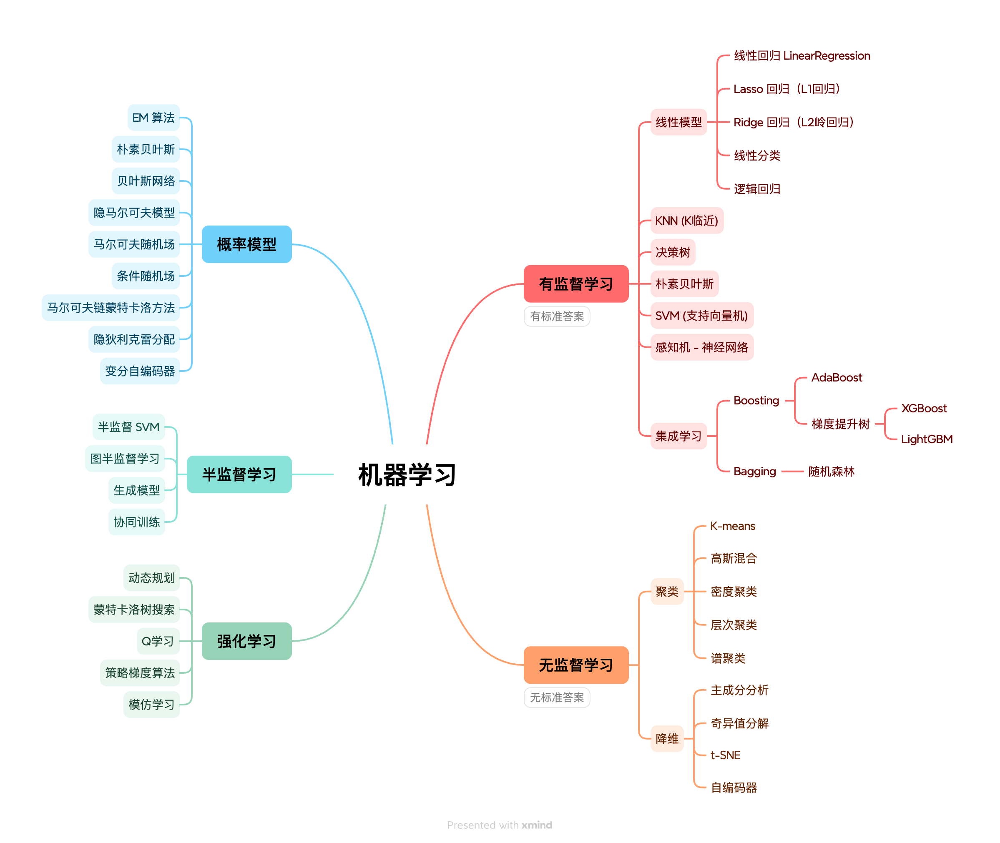
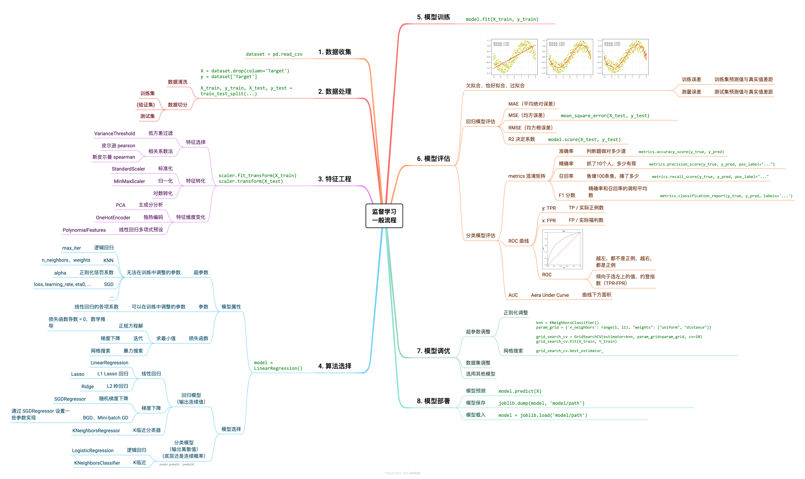

# 数据分析

- [NumPy 笔记](notes/numpy.md)
- [Pandas 笔记](notes/pandas.md)
- [Matplotlib 笔记](notes/matplotlib.md)
- [Seaborn 笔记](notes/seaborn.md)

# 机器学习基础

* 机器学习方法汇总



* 有监督训练核心流程：



## 核心 API

```text
sklearn
    sklearn.feature_selection
        VarianceThreshold # 低方差过滤
    sklearn.preprocessing
    sklearn.model_selection
```

## 公式总结

- [公式总结](notes/formula.md)

## 特征工程

- [特征工程](notes/feature-engineering.md)

```
低方差过滤 ｜ 相关系数法 ｜ 独热编码 ｜ 标准化 ｜ PCA | 列转换器
```