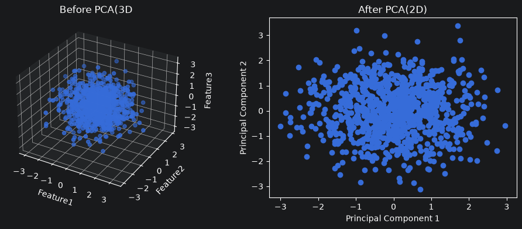

# 特征工程

## 低方差过滤
* 没有方差的数据（都是一个值），对拟合规律提供不了帮助
```python
var_thresh = VarianceThreshold(threshold = 0.01)
X_filtered = var_thresh.fit_transform(X)
```

## 相关系数法
* 寻找与结果相关更大的特征
```python
X.corrwith(y, method="pearson")
X.corrwith(y, method="spearman")
corr_matrix = advertising.corr(method="pearson")
```

## 独热编码
* 如果用 int 分类，类别1 和 类别2 的距离为1，但 类别1 和 类别3 的距离为 2
* 这样的特征不利于拟合
* 第一列可丢
```python
X = OneHotEncoder(drop='first').fit_transform(X)
```

## 归一化

* 将数据按比例缩放到 $[x_{min}, x_{max}]$，通常是 [0,1] 或者 [-1,1]
* 消除量纲差异
    > 避免模型被大范围特征主导（身高 180，年龄 30） 
* 对异常值敏感

```python
X = MinMaxScaler(feature_range=(-1, 1)).fit_transform(X)
```

## 标准化

* 将数据调整为均值为 0、标准差为 1 的标准分布。

```python
X = StandardScaler().fit_transform(X)
```

## PCA

* Principal Component Analysis, 主成分分析
* 数学基础为矩阵的奇异值分解
* 裁剪维度，保留主要信息

```python
X = PCA(n_components=2).fit_transform(X)
```



奇异值分解示例：
$$A = \begin{bmatrix} 1 & 1 \\ 2 & 2 \\ 0 & 0 \end{bmatrix} 
= U\Sigma V^T 
= \begin{bmatrix} 
\frac{1}{\sqrt{5}} & -\frac{2}{\sqrt{5}} & 0 \\ 
\frac{2}{\sqrt{5}} & \frac{1}{\sqrt{5}} & 0 \\ 
0 & 0 & 1 
\end{bmatrix} 
\begin{bmatrix} 
\sqrt{10} & 0 & 0 \\ 
0 & 0 & 0 \\ 
0 & 0 & 0 
\end{bmatrix} 
\begin{bmatrix} 
\frac{1}{\sqrt{2}} & \frac{1}{\sqrt{2}} \\ 
\frac{1}{\sqrt{2}} & -\frac{1}{\sqrt{2}} 
\end{bmatrix}$$

将 $U$ 减少两个维度，依然能够还原 $A$（矩阵$A$的秩只有1）

$$A = \begin{bmatrix} 1 & 1 \\ 2 & 2 \\ 0 & 0 \end{bmatrix} 
= U\Sigma V^T 
= \begin{bmatrix} 
\frac{1}{\sqrt{5}}  \\ 
\frac{2}{\sqrt{5}} \\ 
0  
\end{bmatrix} 
\begin{bmatrix} 
\sqrt{10} 
\end{bmatrix} 
\begin{bmatrix} 
\frac{1}{\sqrt{2}} & \frac{1}{\sqrt{2}} 
\end{bmatrix}$$

## 列转换器

```python
# 数值
numerical_feats = ["年龄", "静息血压", "胆固醇", "最大心率", "运动后的ST下降", "主血管数量"]
# 类别类特征
category_feats = ["胸痛类型", "静息心电图结果", "峰值ST段的斜率", "地中海贫血"]
# 二元特征
binary_feats = ["性别", "空腹血糖", "运动性心绞痛"]

ct = ColumnTransformer(transformers=[
    ('num', StandardScaler(), numerical_feats),
    ('cat', OneHotEncoder(drop='first'), category_feats),
    ('bin', 'passthrough', binary_feats)
])

X_train = ct.fit_transform(X_train)
X_test = ct.transform(X_test)
```

其中 `num` `cat` `bin` 只是别名，便于后续索引，

`passthrougn` 为固定关键字

`ColumnTransformer` 可以对数据分门别类进行处理

## 关于 transform 和 fit_transform

```python
xxx = XXScaler()
X_train = xxx.fit_transform(X)
X_test = xxx.transform(X)
```

同样是对特征向量进行转化
- fit_transform 对 **训练集** 转化，会计算特征均值、方差等信息。
  > 比如标准化的时候，max 和 min 就是根据训练集中的分布确定的
- transform 对 **测试集** 转化，沿用之前 fit、fit_transform 的已经计算过的均值、方差。
  > 你不能说转化测试集的时候，因为只预测一个值，min=max，所以标准化完了后就 mean=min=max，std = 0, 那是绝对错误的。