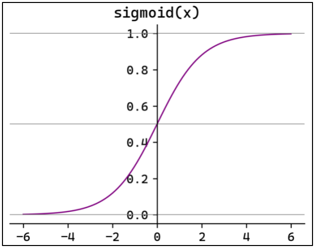

# 逻辑回归的数学原理

## 二元逻辑回归

逻辑回归通过将线性回归，映射到 $[0, 1]$ 区间，表示概率

最常用映射函数为 __Sigmoid__ 函数

$$
f(x) = \frac{1}{1 + e^{-x}}
$$

<div style="text-align: center;">
    
</div>

大于 0.5 取 1（判 yes）， 小于 0.5 取 0（判 no）

导数为

$$
f'(x) = f(x)(1 - f(x))
$$

对于一个有 n 个特征维度的数据集 $\boldsymbol{x}$

寻找一个最合理的 $\boldsymbol{\beta}$，使得

$$
P(y = 1|x) = \frac{1}{1 + e^{-\left(\beta_0 + \beta_1 x_1 + \beta_2 x_2 + \ldots + \beta_n x_n\right)}}
$$

基于给出的 $\boldsymbol{x}$，预测的 $y$ 的发生概率最准

怎么样算准呢？（👇）

## 损失函数 - 二元交叉熵

二元交叉熵损失函数

$$
\begin{align*}
P(y = 1 \mid x; \beta) &= \frac{1}{1 + e^{-(\beta^T x)}} \\
P(y = 0 \mid x; \beta) &= 1 - \frac{1}{1 + e^{-(\beta^T x)}}
\end{align*}
$$

既然 $y$ 不是 0 就是 1，天才的数学家，直接令损失函数为：

$$
P(y \mid x; \beta) =  \left(\frac{1}{1 + e^{-(\beta^T x)}}\right)^y \left(1 - \frac{1}{1 + e^{-(\beta^T x)}}\right)^{1-y}
$$

即，二元交叉熵

对数似然函数：

$$
\begin{align*}
\text{Loss} &= -\frac{1}{n} \ln L(\boldsymbol{\beta}) \\ 
&= -\frac{1}{n} \sum_{i=1}^{n} \left( y_i \ln P(y_i = 1 \mid x_i; \boldsymbol{\beta}) + (1 - y_i) \ln (1 - P(y_i = 1 \mid x_i; \boldsymbol{\beta})) \right)
\end{align*}
$$

二元交叉熵损失函数最大值，也就是对数似然函数最大值，求导求解，
__无数学解析解__，

故只能用梯度下降法求解，

所以逻辑回归模型，有关于梯度下降的超参数。

```python
# solver: 优化算法
#   lbfgs: 拟牛顿法（默认），仅支持L2正则化
#   newton-cg: 牛顿法，仅支持L2正则化
#   liblinear: 坐标下降法，适用于小数据集，支持L1和L2正则化
#   sag: 随机平均梯度下降，适用于大规模数据集，仅支持L2正则化
#   saga: 改进的随机梯度下降，适用于大规模数据，支持L1、L2和ElasticNet正则化
# penalty: 正则化类型，可选l1、l2和elasticnet
# C: 正则化强度，C越小，正则化强度越大
# class_weight: 类别权重，balanced表示自动平衡类别权重，让模型在训练时更关注少数类，从而减少类别不平衡带来的偏差

model = sklearn.linear_model.LogisticRegression(
    solver="lbfgs",
    penalty="l2",
    C=1,
    class_weight="balanced")
```

加了 L2 正则化后的损失函数：

$$
J(\mathbf{w}, b) = -\frac{1}{n} \sum_{i=1}^{n} \left[ y_i \log(\hat{y}_i) + (1 - y_i) \log(1 - \hat{y}_i) \right] + \frac{\lambda}{2n} \|\mathbf{w}\|_2^2
$$

其中，

$$
\hat{y}_i = \frac{1}{1 + e^{\mathbf{w}^T\boldsymbol{x_i} + b}}
$$

一般不对偏置参数 $b$ 做正则化

## OvR（One-vs-Rest：一对多）

计算每个类别的输出概率，选类别最高的类别

> * 每个类别需要训练一个二元分类器，类别多了训练时间长
> * 所有类别概率和不为 1

对于类别 $c$，

$$
P(y = c \mid x; \beta) = \frac{1}{1 + e^{-(\beta^T x)}}
$$

$$
\begin{align*}
\text{Loss} &= -\frac{1}{n} \sum_{i=1}^n \left( y_i \log p_i + (1 - y_i) \log (1 - p_i) \right) \\
&= -\frac{1}{n} \Big[
\left( y_1 \log p_1 + (1 - y_1) \log (1 - p_1) \right) \\
&\qquad + \left( y_2 \log p_2 + (1 - y_2) \log (1 - p_2) \right) \\
&\qquad + \cdots \\
&\qquad + \left( y_n \log p_n + (1 - y_n) \log (1 - p_n) \right)
\Big]
\end{align*}
$$

依然没有解析解，只有梯度下降。

API 调用：


```python
sklearn.linear_model.LogisticRegression(multi_class="ovr")
```
或
```python
sklearn.multiclass.OneVsRestClassifier(LogisticRegression())
```

## Softmax 回归

> * 只训练 1 个模型，分类一致性好
> * 所有分类概率和为 1
> * 计算量高（要对所有类别求指数）

对于类别 c

$$
P(y = c \mid \mathbf{x}; \mathbf{W}) = \frac{e^{\mathbf{w}_c^T \mathbf{x}}}{\sum_{j=1}^K e^{\mathbf{w}_j^T \mathbf{x}}} = \frac{e^{\mathbf{w}_c^T \mathbf{x}}}{e^{\mathbf{w}_1^T \mathbf{x}} + e^{\mathbf{w}_2^T \mathbf{x}} + \cdots + e^{\mathbf{w}_K^T \mathbf{x}}}
$$

损失函数：

$$
\text{Loss} = -\frac{1}{n} \sum_{i=1}^{n} \sum_{c=1}^{C} \mathbb{I}(y_i = c) \log P(y_i = c \mid \mathbf{x}_i)
$$

$\mathbb{I}$ 为示性函数，当 $y_i=c$ 时值为1，反之值为0

展开写写：

$$
\text{Loss} = -\frac{1}{n} \Bigg[
\log\left( \frac{e^{\mathbf{w}_{c_1}^T \mathbf{x}_1}}{\sum_{j=1}^{C} e^{\mathbf{w}_j^T \mathbf{x}_1}} \right)
+ \log\left( \frac{e^{\mathbf{w}_{c_2}^T \mathbf{x}_2}}{\sum_{j=1}^{C} e^{\mathbf{w}_j^T \mathbf{x}_2}} \right)
+ \cdots
+ \log\left( \frac{e^{\mathbf{w}_{c_n}^T \mathbf{x}_n}}{\sum_{j=1}^{C} e^{\mathbf{w}_j^T \mathbf{x}_n}} \right)
\Bigg]
$$

同样， Softmax 没有解析解，依然依靠梯度下降，损失函数导函数为：

$$
\nabla_{\mathbf{W}} \mathcal{L} = \frac{1}{n} \mathbf{X}^T (\mathbf{P} - \mathbf{Y})
$$

* $X$ 是 $n \times p$ 的设计矩阵
* $P$ 是 $n \times K$ 的预测概率矩阵
* $Y$ 是 $n \times K$ 的 onehot 标签矩阵

* $n$ 样本量， $p$ 特征数, $K$ 分类数

API 调用：

```python
from sklearn.linear_model import LogisticRegression

model = LogisticRegression(multi_class="multinomial")

# 对于多分类问题，LogisticRegression会自动使用multinomial，因此multi_class参数可省略

model = LogisticRegression()
```