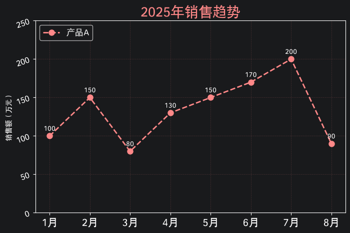
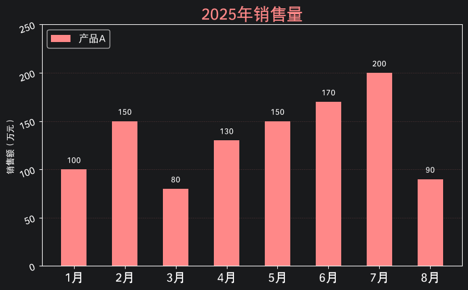
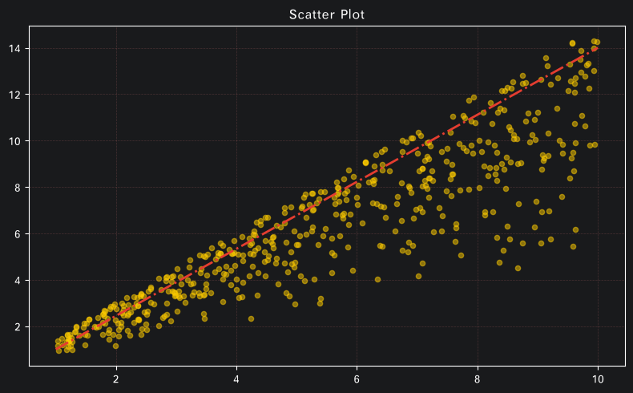
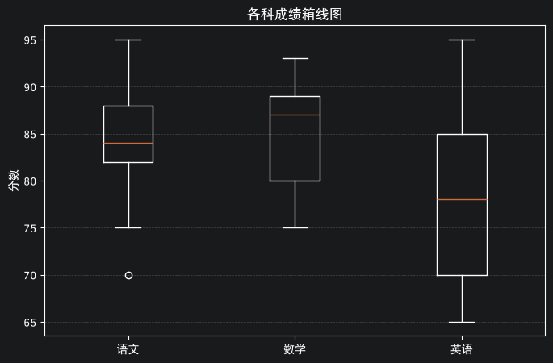
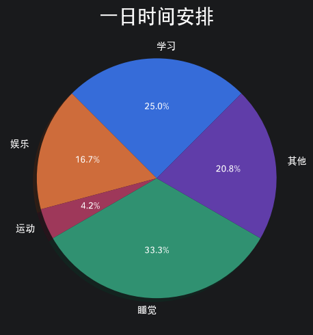

# Matplotlib

`matplotlib.pyplot` —— Python 最常用的 2D 绘图库，`plt.xxx()` 一句话即可出图。

| 图表类型 | 适用场景 | API |
| :--- | :--- | :--- |
| 折线图 | 趋势变化 | `plt.plot` |
| 柱状图 | 对比大小 | `plt.bar` / `plt.barh` |
| 散点图 | 分布 / 相关性 | `plt.scatter` |
| 饼图 | 占比构成 | `plt.pie` |
| 箱线图 | 分布 / 异常值 | `plt.boxplot` |

## 通用流程

```python
import matplotlib.pyplot as plt
from matplotlib import rcParams
rcParams['font.family'] = ['Hei']   # 中文字体，避免乱码

# 1. 创建画布
plt.figure(figsize=(8, 5))

# 2. 绘图（见下方各图表 API）
plt.plot(x, y, ...)

# 3. 装饰
plt.title('标题', fontsize=20, color='#ff8888')   # 标题
plt.xlabel('x 轴')                                 # x 轴标签
plt.ylabel('y 轴')                                 # y 轴标签
plt.xticks(rotation=0, fontsize=15)                # 刻度
plt.ylim(0, 250)                                   # 坐标范围
plt.legend(loc='upper left')                       # 图例
plt.grid(axis='y', alpha=0.2, linestyle='--')      # 网格线
for x, y in zip(xs, ys):
    plt.text(x, y+5, str(y), ha='center')          # 数据标注

# 4. 展示
plt.tight_layout()   # 自动优化排版
plt.show()
```

## 图表示例

<div style="display: flex; flex-wrap: wrap; gap: 16px; justify-content: center;">

  <div style="flex: 0 0 calc(50% - 8px); box-sizing: border-box; background: #191A1C; border: 1px solid #2a2c2e; border-radius: 12px; padding: 10px; box-shadow: 0 2px 10px rgba(0,0,0,0.2);">
    
    <p style="text-align: center; margin: 10px 0 2px; font-weight: 600; color: #d5d8db;">折线图 · <code>plt.plot</code></p>
  </div>

  <div style="flex: 0 0 calc(50% - 8px); box-sizing: border-box; background: #191A1C; border: 1px solid #2a2c2e; border-radius: 12px; padding: 10px; box-shadow: 0 2px 10px rgba(0,0,0,0.2);">
    
    <p style="text-align: center; margin: 10px 0 2px; font-weight: 600; color: #d5d8db;">柱状图 · <code>plt.bar</code></p>
  </div>

  <div style="flex: 0 0 calc(50% - 8px); box-sizing: border-box; background: #191A1C; border: 1px solid #2a2c2e; border-radius: 12px; padding: 10px; box-shadow: 0 2px 10px rgba(0,0,0,0.2);">
    
    <p style="text-align: center; margin: 10px 0 2px; font-weight: 600; color: #d5d8db;">散点图 · <code>plt.scatter</code></p>
  </div>

  <div style="flex: 0 0 calc(50% - 8px); box-sizing: border-box; background: #191A1C; border: 1px solid #2a2c2e; border-radius: 12px; padding: 10px; box-shadow: 0 2px 10px rgba(0,0,0,0.2);">
    
    <p style="text-align: center; margin: 10px 0 2px; font-weight: 600; color: #d5d8db;">箱线图 · <code>plt.boxplot</code></p>
  </div>

  <div style="flex: 0 0 calc(50% - 8px); box-sizing: border-box; background: #191A1C; border: 1px solid #2a2c2e; border-radius: 12px; padding: 10px; box-shadow: 0 2px 10px rgba(0,0,0,0.2);">
    
    <p style="text-align: center; margin: 10px 0 2px; font-weight: 600; color: #d5d8db;">饼图 · <code>plt.pie</code></p>
  </div>

</div>

## 折线图 plot

连接数据点，观察**趋势变化**。

```python
plt.plot(month, sales,
         color='#ff8888',
         linestyle='--',   # 线型：-  --  -.  :
         linewidth=2,      # 线宽
         marker='o',       # 数据点形状
         markersize=8,     # 数据点大小
         label='产品A')    # 图例名
```

## 柱状图 bar

对比不同类别的**数值大小**。

```python
plt.bar(month, sales,
        color='#ff8888',
        width=0.5,      # 柱宽
        label='产品A')

plt.barh(month, sales)  # 横向条形图
```

## 散点图 scatter

观察两变量间的**分布 / 相关性**。

```python
plt.scatter(x, y,
            color='#ffcc00',
            alpha=0.5,  # 透明度
            s=20)       # 点大小
```

## 饼图 pie

展示各部分的**占比构成**。

```python
plt.pie(times, labels=things,
        autopct='%1.1f%%',         # 百分比显示格式
        shadow=True,               # 阴影
        startangle=45,             # 起始角度
        explode=[0.1, 0, 0, 0, 0], # 突出某一块（爆炸饼图）
        wedgeprops={'width': 0.5}) # 设置 width 变环形图
```

## 箱线图 boxplot

展示数据的**中位数、四分位数与异常值**。

```python
data = {
    '语文': [82, 85, 88, 70, 90, 75, 84, 83, 95],
    '数学': [75, 80, 79, 93, 88, 82, 87, 89, 92],
    '英语': [70, 72, 68, 65, 78, 80, 85, 90, 95],
}
plt.boxplot(data.values(), tick_labels=data.keys())
```
