# Seaborn

`seaborn` —— 基于 matplotlib 的**统计绘图库**，内置统计图形封装与配色主题，`sns.xxx()` 一行即可出图。

| 图表类型 | 适用场景 | API |
| :--- | :--- | :--- |
| 直方图 | 连续量区间分布 | `sns.histplot` |
| 核密度估计 | 分布平滑曲线 | `sns.kdeplot` |
| 计数图 | 离散量取值统计 | `sns.countplot` |
| 散点图 | 分布 / 相关性 | `sns.scatterplot` |
| 蜂窝图 | 点密集时的分布 | `sns.jointplot` |
| 二维 KDE | 双变量联合密度 | `sns.kdeplot` |
| 条形图 | 分类均值对比 | `sns.barplot` |
| 箱线图 | 分类分布 / 异常值 | `sns.boxplot` |
| 小提琴图 | 分类分布形态 | `sns.violinplot` |
| 成对关系图 | 多变量两两关系 | `sns.pairplot` |
| 热力图 | 矩阵数值 / 相关性 | `sns.heatmap` |

## 通用流程

```python
import pandas as pd
import matplotlib.pyplot as plt
import seaborn as sns
from matplotlib import rcParams
rcParams['font.sans-serif'] = ['STHeiti']   # 中文字体，避免乱码
rcParams['axes.unicode_minus'] = False      # 坐标轴正常显示负号

# 1. 准备数据：Palmer Penguins 企鹅数据集（即仓库 data/penguins.csv）
penguins = sns.load_dataset('penguins')
penguins.dropna(inplace=True)   # 去除缺失值

# 2. 绘图（见下方各图表 API）
sns.histplot(data=penguins, x='bill_length_mm')

# 3. 展示
plt.show()
```

## 图表示例

<table>
  <tr>
    <td align="center" style="width: 50%; background: #191A1C; border: 1px solid #2a2c2e; border-radius: 12px; padding: 10px; box-shadow: 0 2px 10px rgba(0,0,0,0.2);">
      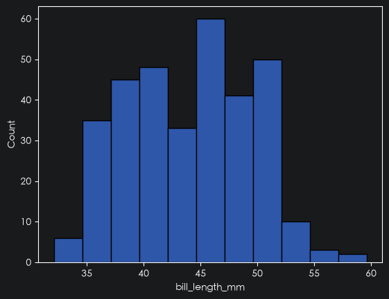
      <p style="text-align: center; margin: 10px 0 2px; font-weight: 600; color: #d5d8db;">直方图 · <code>sns.histplot</code></p>
    </td>
    <td align="center" style="width: 50%; background: #191A1C; border: 1px solid #2a2c2e; border-radius: 12px; padding: 10px; box-shadow: 0 2px 10px rgba(0,0,0,0.2);">
      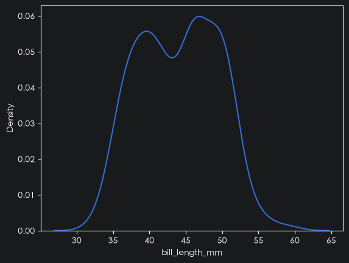
      <p style="text-align: center; margin: 10px 0 2px; font-weight: 600; color: #d5d8db;">核密度估计 · <code>sns.kdeplot</code></p>
    </td>
  </tr>
  <tr>
    <td align="center" style="width: 50%; background: #191A1C; border: 1px solid #2a2c2e; border-radius: 12px; padding: 10px; box-shadow: 0 2px 10px rgba(0,0,0,0.2);">
      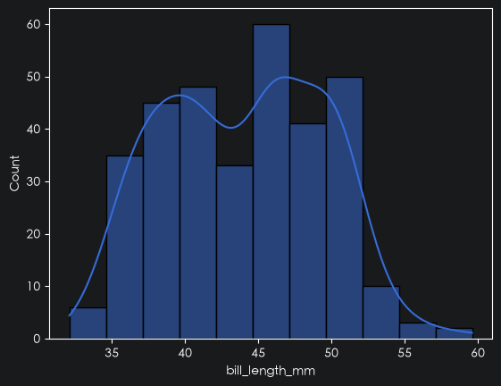
      <p style="text-align: center; margin: 10px 0 2px; font-weight: 600; color: #d5d8db;">直方图 + KDE · <code>kde=True</code></p>
    </td>
    <td align="center" style="width: 50%; background: #191A1C; border: 1px solid #2a2c2e; border-radius: 12px; padding: 10px; box-shadow: 0 2px 10px rgba(0,0,0,0.2);">
      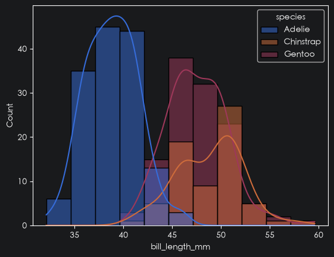
      <p style="text-align: center; margin: 10px 0 2px; font-weight: 600; color: #d5d8db;">分组直方图 · <code>hue='species'</code></p>
    </td>
  </tr>
  <tr>
    <td align="center" style="width: 50%; background: #191A1C; border: 1px solid #2a2c2e; border-radius: 12px; padding: 10px; box-shadow: 0 2px 10px rgba(0,0,0,0.2);">
      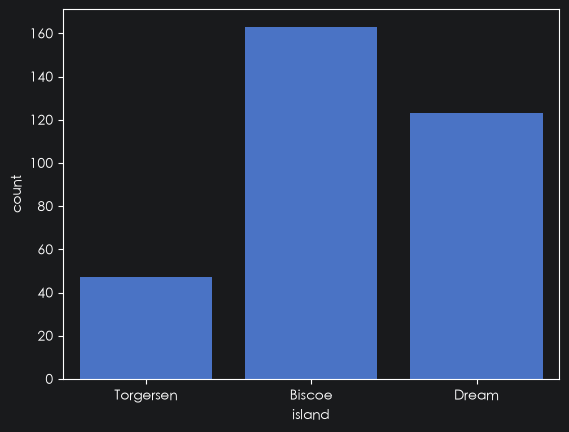
      <p style="text-align: center; margin: 10px 0 2px; font-weight: 600; color: #d5d8db;">计数图 · <code>sns.countplot</code></p>
    </td>
    <td align="center" style="width: 50%; background: #191A1C; border: 1px solid #2a2c2e; border-radius: 12px; padding: 10px; box-shadow: 0 2px 10px rgba(0,0,0,0.2);">
      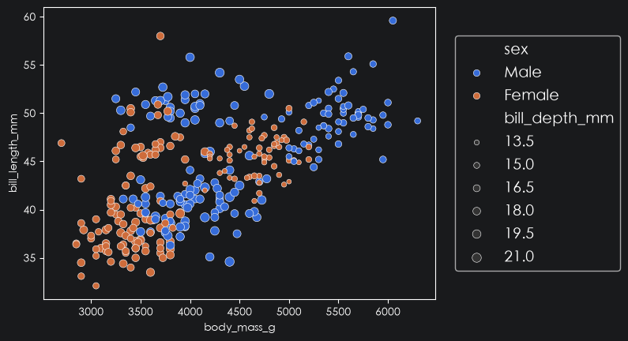
      <p style="text-align: center; margin: 10px 0 2px; font-weight: 600; color: #d5d8db;">散点图 · <code>sns.scatterplot</code></p>
    </td>
  </tr>
  <tr>
    <td align="center" style="width: 50%; background: #191A1C; border: 1px solid #2a2c2e; border-radius: 12px; padding: 10px; box-shadow: 0 2px 10px rgba(0,0,0,0.2);">
      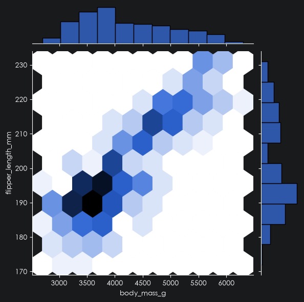
      <p style="text-align: center; margin: 10px 0 2px; font-weight: 600; color: #d5d8db;">蜂窝图 · <code>sns.jointplot</code></p>
    </td>
    <td align="center" style="width: 50%; background: #191A1C; border: 1px solid #2a2c2e; border-radius: 12px; padding: 10px; box-shadow: 0 2px 10px rgba(0,0,0,0.2);">
      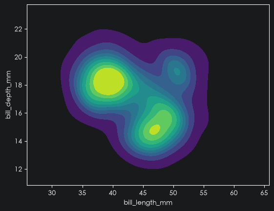
      <p style="text-align: center; margin: 10px 0 2px; font-weight: 600; color: #d5d8db;">二维 KDE · <code>sns.kdeplot(x, y)</code></p>
    </td>
  </tr>
  <tr>
    <td align="center" style="width: 50%; background: #191A1C; border: 1px solid #2a2c2e; border-radius: 12px; padding: 10px; box-shadow: 0 2px 10px rgba(0,0,0,0.2);">
      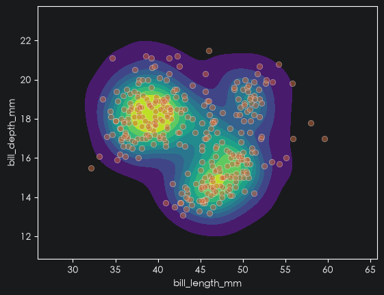
      <p style="text-align: center; margin: 10px 0 2px; font-weight: 600; color: #d5d8db;">二维 KDE + 散点 · <code>叠加</code></p>
    </td>
    <td align="center" style="width: 50%; background: #191A1C; border: 1px solid #2a2c2e; border-radius: 12px; padding: 10px; box-shadow: 0 2px 10px rgba(0,0,0,0.2);">
      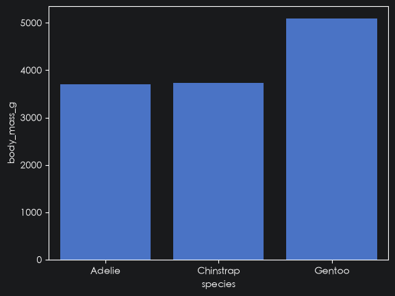
      <p style="text-align: center; margin: 10px 0 2px; font-weight: 600; color: #d5d8db;">条形图 · <code>sns.barplot</code></p>
    </td>
  </tr>
  <tr>
    <td align="center" style="width: 50%; background: #191A1C; border: 1px solid #2a2c2e; border-radius: 12px; padding: 10px; box-shadow: 0 2px 10px rgba(0,0,0,0.2);">
      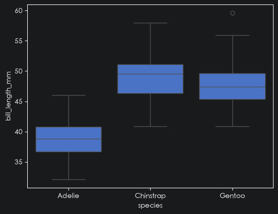
      <p style="text-align: center; margin: 10px 0 2px; font-weight: 600; color: #d5d8db;">箱线图 · <code>sns.boxplot</code></p>
    </td>
    <td align="center" style="width: 50%; background: #191A1C; border: 1px solid #2a2c2e; border-radius: 12px; padding: 10px; box-shadow: 0 2px 10px rgba(0,0,0,0.2);">
      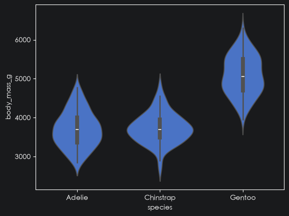
      <p style="text-align: center; margin: 10px 0 2px; font-weight: 600; color: #d5d8db;">小提琴图 · <code>sns.violinplot</code></p>
    </td>
  </tr>
  <tr>
    <td align="center" style="width: 50%; background: #191A1C; border: 1px solid #2a2c2e; border-radius: 12px; padding: 10px; box-shadow: 0 2px 10px rgba(0,0,0,0.2);">
      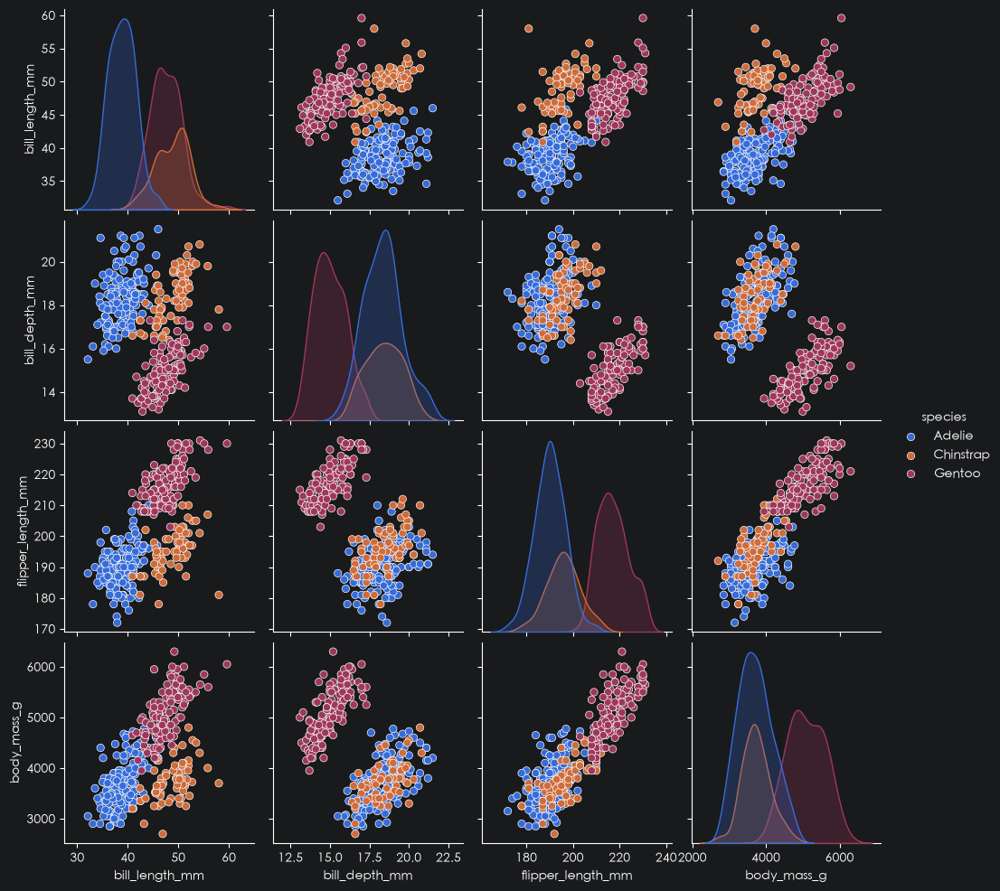
      <p style="text-align: center; margin: 10px 0 2px; font-weight: 600; color: #d5d8db;">成对关系图 · <code>sns.pairplot</code></p>
    </td>
    <td align="center" style="width: 50%; background: #191A1C; border: 1px solid #2a2c2e; border-radius: 12px; padding: 10px; box-shadow: 0 2px 10px rgba(0,0,0,0.2);">
      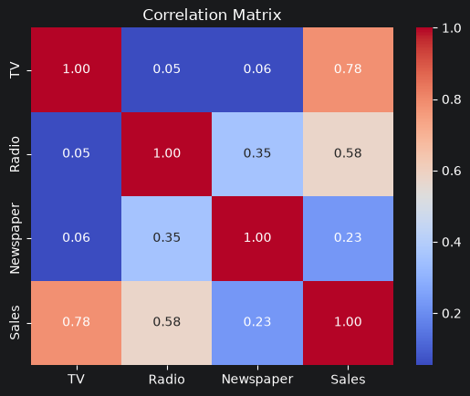
      <p style="text-align: center; margin: 10px 0 2px; font-weight: 600; color: #d5d8db;">热力图 · <code>sns.heatmap</code></p>
    </td>
  </tr>
</table>

## 分布图

### 直方图 histplot

统计连续量的**区间分布**，一根柱子代表一个区间的数量。

```python
sns.histplot(data=penguins, x='bill_length_mm')

# 叠加核密度曲线
sns.histplot(data=penguins, x='bill_length_mm', kde=True)

# hue 按类别分组
sns.histplot(data=penguins, x='bill_length_mm', hue='species', kde=True)
```

### 核密度估计 kdeplot

直方图的平滑版本，曲线下面积积分严格等于 1。

```python
sns.kdeplot(data=penguins, x='bill_length_mm')
```

### 计数图 countplot

统计**离散量**每个取值的数量，一根柱子代表一个值。

```python
sns.countplot(data=penguins, x='island')
```

> 计数图与直方图的区别：计数图统计的是离散量，一根柱子代表一个值；直方图统计的是连续量，一根柱子代表某一个区间的统计数量。

## 关系图

### 散点图 scatterplot

观察两变量间的**分布 / 相关性**。

```python
sns.scatterplot(data=penguins, x='body_mass_g', y='bill_length_mm',
                hue='sex',            # 按类别着色
                size='bill_depth_mm') # 按数值定大小
# 调用 matplotlib 中的方法把图例放在图外
plt.legend(bbox_to_anchor=(1.05, 0.5), loc='center left', borderaxespad=0, prop={'size': 14})
```

### 蜂窝图 jointplot

点密集时用**六边形格**的颜色深浅表示点数量。

```python
sns.jointplot(data=penguins, x='body_mass_g', y='flipper_length_mm', kind='hex')
```

### 二维 KDE kdeplot

两个连续变量的**联合密度**。

```python
sns.kdeplot(data=penguins, x='bill_length_mm', y='bill_depth_mm',
            fill=True, cmap='viridis')
```

散点图可与二维 KDE 叠加：

```python
sns.kdeplot(data=penguins, x='bill_length_mm', y='bill_depth_mm', fill=True, cmap='viridis')
sns.scatterplot(data=penguins, x='bill_length_mm', y='bill_depth_mm', alpha=0.5)
plt.show()
```

## 分类图

### 条形图 barplot

对比各类别的**均值**。

```python
sns.barplot(data=penguins, x='species', y='body_mass_g',
            estimator='mean',   # 聚合方式
            errorbar=None)      # 隐藏误差棒
```

### 箱线图 boxplot

展示各类别数据的**中位数、四分位数与异常值**。

```python
sns.boxplot(data=penguins, x='species', y='bill_length_mm')
plt.show()
```

### 小提琴图 violinplot

在箱线图基础上展示分布的**形态**（宽度表示密度）。

```python
sns.violinplot(data=penguins, x='species', y='body_mass_g')
```

## 成对关系图 pairplot

对 DataFrame 所有数值列**两两组合**绘图，`hue` 按类别着色。

```python
sns.pairplot(data=penguins, hue='species')
```

## 热力图 heatmap

用**颜色深浅**展示矩阵数值大小，常用于相关性矩阵。

```python
advertising = pd.read_csv('data/advertising.csv')

sns.heatmap(data=advertising.corr(),
            annot=True,      # 在格子里显示数值
            cmap='coolwarm', # 颜色映射：蓝 = 负相关，红 = 正相关
            fmt='.2f')       # 数值保留两位小数
plt.title('Correlation Matrix')
plt.show()
```
